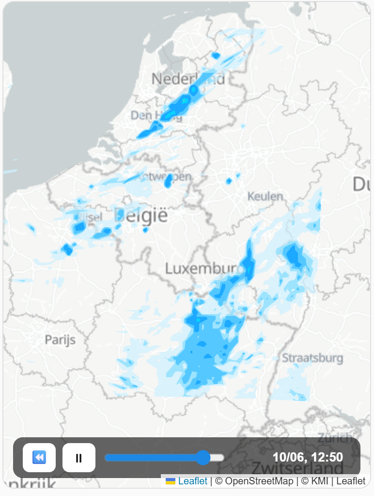
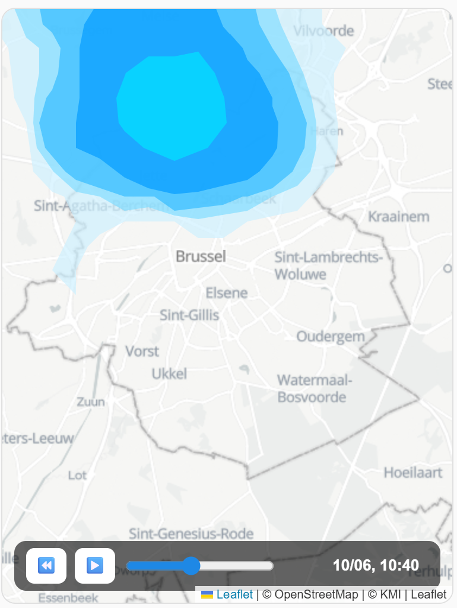

# KMI Weather Radar Beta

Animated Home Assistant dashboard card for the Belgian KMI/RMI beta precipitation radar.





This HACS custom **integration** provides:

- a Home Assistant backend proxy for KMI radar data, avoiding browser CORS issues;
- a bundled Lovelace dashboard card served by the integration;
- automatic Lovelace resource registration in storage-mode dashboards;
- animated radar frames, play/pause, rewind, timeline slider, local Belgian time and attribution.

## Installation with HACS

1. In HACS, add this repository as a custom repository.
2. Select type: **Integration**.
3. Install **KMI Weather Radar Beta**.
4. Restart Home Assistant.
5. Add the integration via **Settings → Devices & services → Add integration → KMI Weather Radar Beta**.

The integration tries to automatically add this Lovelace resource:

```text
/kmi_weather_radar_beta/kmi-weather-radar-beta.js?v=<version>
```

If you use YAML-mode dashboards, or if automatic registration is unavailable in your Home Assistant setup, add the resource manually:

```text
URL: /kmi_weather_radar_beta/kmi-weather-radar-beta.js
Type: JavaScript module
```

## Dashboard YAML

```yaml
type: custom:kmi-weather-radar-beta
height: 500px
center:
  - 51.0
  - 4.5
zoom: 8
refresh_interval: 120
animation_interval: 0.7
max_frames: 40
```

## Card options

| Option | Default | Description |
| --- | --- | --- |
| `height` | `500px` | Card height. |
| `center` | `[51.0, 4.5]` | Initial map center. |
| `zoom` | `8` | Initial Leaflet zoom level. |
| `refresh_interval` | `120` | How often the card checks for a new KMI frame list, in seconds. |
| `animation_interval` | `0.7` | Time between animation frames, in seconds. |
| `max_frames` | `40` | Maximum number of radar frames to request from the backend. |
| `tile_url` | KMI light map | Leaflet tile URL template. |
| `attribution` | `© OpenStreetMap | © KMI | Leaflet` | Attribution shown by Leaflet. |

`update_interval` is accepted as a backwards-compatible alias for `refresh_interval`, but `refresh_interval` is preferred.

`frame_interval` was removed. Use `animation_interval` instead.

## Notes

This project uses public KMI/RMI beta radar data and renders it locally in Home Assistant. It is not affiliated with or endorsed by KMI/RMI.

Attribution is shown on the card for OpenStreetMap, KMI and Leaflet.

## Brand icon

The included icon is an original radar/weather icon made for this project. It is not the official KMI logo.


## Troubleshooting

### Map tiles keep missing until refresh

Version 0.1.5 adds delayed Leaflet size invalidation, resize observation and tile retry handling. If you still see missing base-map tiles, clear the browser cache or reload the Lovelace resource after updating.
